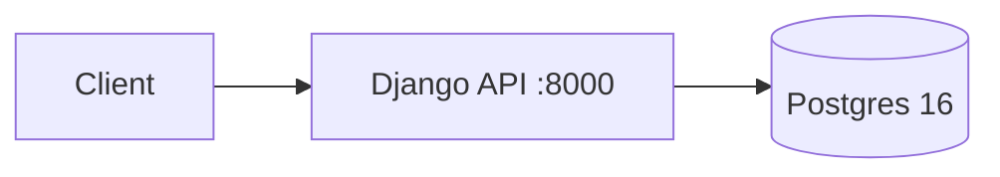

# Crypto API - System Architecture (Backend only)

## Overview

Crypto research backend: users → coins → watchlists → notes → price snapshots. Sync DRF API, no async workers.

| Layer | Choice |
|---|---|
| API | Django 5.2 + DRF + `django-configurations` (`Common` / `Develop` / `Production`) |
| DB | Postgres 16 + `pg_trgm` |
| Cache | `locmem` (no Redis) |
| Sessions | DB-backed |
| Server | Gunicorn 3×sync `:8000` + WhiteNoise |
| Deps | Poetry, Python 3.12 image |
| Auth | DRF Token + Session |

## Modules

| Module | Responsibility |
|---|---|
| `users` | Custom User, Token register/login/logout/me, 
| `research` | Coin, Watchlist, ResearchNote, PriceSnapshot |
| `core` | `health_check` |

## Auth

1. `POST /api/users/register/` → `{user, token}`.
2. `POST /api/users/login/` → `{user, token}`.
3. Client sends `Authorization: Token <key>`.
4. `POST /api/users/logout/` deletes token.

## Routes

- `/admin/`, `/api/health/`
- `/api/users/register|login|logout|me/`
- `/api/research/coins|watchlists|watchlist-items|notes|prices/`
