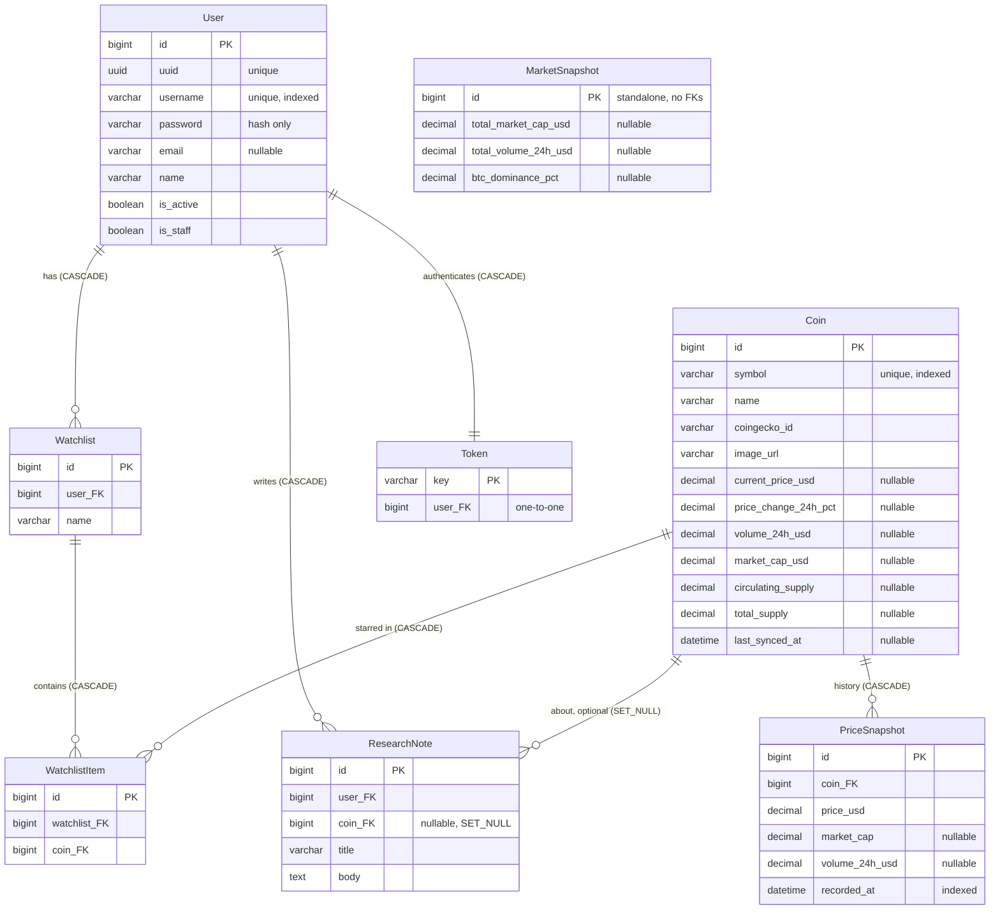
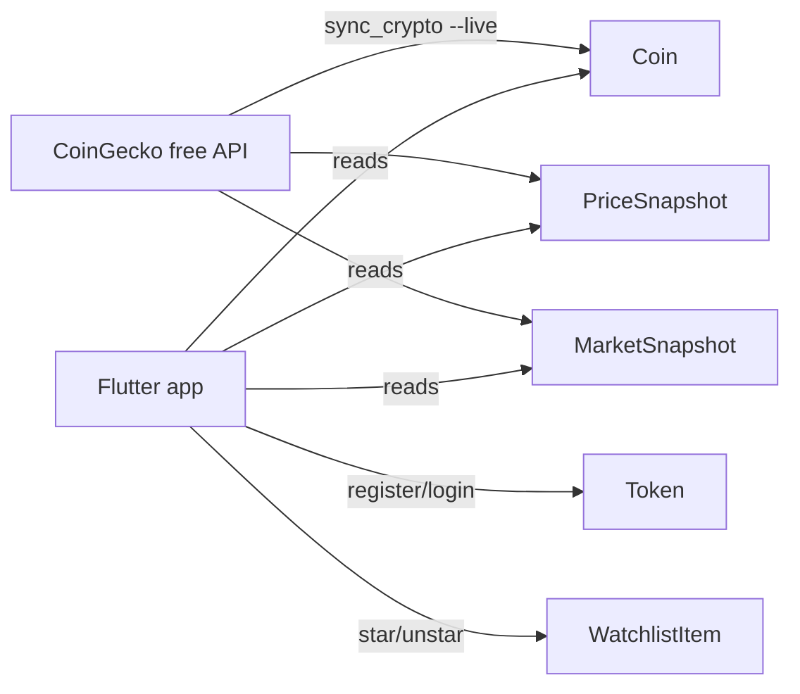

# ERD - Crypto API

Source of truth: `crypto-api/api/users/models.py`, `crypto-api/api/research/models.py`
(Django/DRF defaults included). Verified against `makemigrations --check` (no pending changes).

## 1. Entities & fields

### `users.User` - app account (`api/users/models.py:29-48`)

| Field | Type | Constraints |
|---|---|---|
| `id` | BigAuto | PK |
| `uuid` | UUID | unique |
| `username` | varchar(150) | unique, indexed (`user_username_idx`) |
| `password` | varchar | hash only, never plain text (from `AbstractBaseUser`) |
| `email` | varchar(255) | nullable/blank |
| `name` | varchar(255) | blank, default `""` |
| `is_active` | bool | default `True` (login gate via `IsActiveUser`) |
| `is_staff` | bool | default `False` (admin access) |
| `is_superuser` | bool | from `PermissionsMixin` |
| `last_login` | datetime | nullable (from `AbstractBaseUser`) |
| `groups` | M2M → `auth.Group` | join table `users_user_groups` |
| `user_permissions` | M2M → `auth.Permission` | join table `users_user_user_permissions` |

`USERNAME_FIELD = username`. No roles - every registered user can use the full app.

### `research.Coin` - coin + latest market data (`api/research/models.py:5-24`)

| Field | Type | Constraints |
|---|---|---|
| `id` | BigAuto | PK |
| `symbol` | varchar(20) | unique, indexed (e.g. `BTC`) |
| `name` | varchar(100) | (e.g. `Bitcoin`) |
| `coingecko_id` | varchar(100) | blank (e.g. `bitcoin`, chart fallback) |
| `image_url` | URL | blank |
| `current_price_usd` | decimal(20,8) | nullable - `NULL` until first sync |
| `price_change_24h_pct` | decimal(10,4) | nullable |
| `volume_24h_usd` | decimal(24,2) | nullable |
| `market_cap_usd` | decimal(24,2) | nullable |
| `circulating_supply` | decimal(24,2) | nullable |
| `total_supply` | decimal(24,2) | nullable |
| `last_synced_at` | datetime | nullable (drives `is_stale`) |
| `created_at` | datetime | auto now-add |

Default ordering: `symbol`.

### `research.Watchlist` - per-user list (`api/research/models.py:27-37`)

| Field | Type | Constraints |
|---|---|---|
| `id` | BigAuto | PK |
| `user` | FK → `users.User` | `on_delete=CASCADE`, `related_name="watchlists"` |
| `name` | varchar(100) | default `"Default"` |
| `created_at` | datetime | auto now-add |

Unique together: (`user`, `name`). Ordering: `-created_at`.

### `research.WatchlistItem` - starred coin (`api/research/models.py:40-47`)

| Field | Type | Constraints |
|---|---|---|
| `id` | BigAuto | PK |
| `watchlist` | FK → `Watchlist` | `on_delete=CASCADE`, `related_name="items"` |
| `coin` | FK → `Coin` | `on_delete=CASCADE`, `related_name="watchlist_items"` |
| `added_at` | datetime | auto now-add |

Unique together: (`watchlist`, `coin`). Ordering: `-added_at`.

### `research.ResearchNote` - user note (`api/research/models.py:50-66`)

| Field | Type | Constraints |
|---|---|---|
| `id` | BigAuto | PK |
| `user` | FK → `users.User` | `on_delete=CASCADE`, `related_name="research_notes"` |
| `coin` | FK → `Coin` | `on_delete=SET_NULL`, nullable, `related_name="notes"` |
| `title` | varchar(200) | |
| `body` | text | blank, default `""` |
| `created_at` | datetime | auto now-add |
| `updated_at` | datetime | auto now |

Indexes: (`user`, `-created_at`), (`coin`, `-created_at`). Ordering: `-created_at`.

### `research.PriceSnapshot` - chart point (`api/research/models.py:69-80`)

| Field | Type | Constraints |
|---|---|---|
| `id` | BigAuto | PK |
| `coin` | FK → `Coin` | `on_delete=CASCADE`, `related_name="price_snapshots"` |
| `price_usd` | decimal(20,8) | required |
| `market_cap` | decimal(24,2) | nullable |
| `volume_24h_usd` | decimal(24,2) | nullable |
| `recorded_at` | datetime | indexed |

Index: (`coin`, `-recorded_at`). Ordering: `-recorded_at`.

### `research.MarketSnapshot` - global totals (`api/research/models.py:83-92`)

Standalone (no foreign keys). One row per sync; readers use the latest.

| Field | Type | Constraints |
|---|---|---|
| `id` | BigAuto | PK |
| `total_market_cap_usd` | decimal(24,2) | nullable |
| `total_volume_24h_usd` | decimal(24,2) | nullable |
| `btc_dominance_pct` | decimal(7,3) | nullable |
| `recorded_at` | datetime | auto now-add, indexed |

Ordering: `-recorded_at`.

### `authtoken.Token` - login token (DRF default)

| Field | Type | Constraints |
|---|---|---|
| `key` | varchar(40) | PK, random secret |
| `user` | OneToOne → `users.User` | `on_delete=CASCADE` |
| `created` | datetime | auto now-add |

Deleted on logout. One token per user (`get_or_create`).

## 2. Diagram

## 3. Relationship & delete rules

| From → To | Type | On delete | Effect |
|---|---|---|---|
| User → Watchlist | 1 : N | CASCADE | deleting a user deletes their lists |
| Watchlist → WatchlistItem | 1 : N | CASCADE | deleting a list deletes its stars |
| Coin → WatchlistItem | 1 : N | CASCADE | deleting a coin removes it from all lists |
| User → ResearchNote | 1 : N | CASCADE | deleting a user deletes their notes |
| Coin → ResearchNote | 1 : N, optional | SET_NULL | deleting a coin keeps notes, `coin` becomes `NULL` |
| Coin → PriceSnapshot | 1 : N | CASCADE | deleting a coin deletes its chart history |
| User → Token | 1 : 1 | CASCADE | deleting a user deletes the token; logout deletes it directly |
| - | - | - | `MarketSnapshot` has no relations; old rows are simply superseded |

## 4. Data flow (who writes what)

