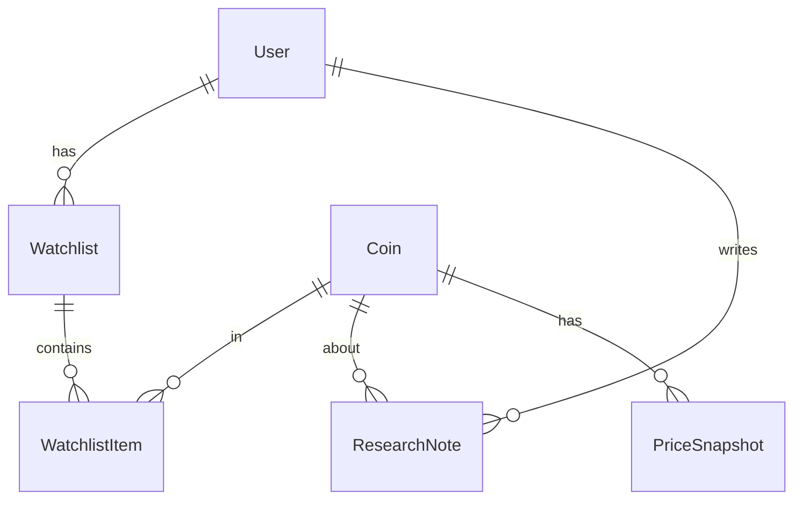

# ERD — Crypto API

## Entities

- `users.User(id, uuid, username unique, email, name, role, is_active, is_staff)`
- `research.Coin(id, symbol unique, name, coingecko_id, created_at)`
- `research.Watchlist(id, user FK→User CASCADE, name, created_at; unique user+name)`
- `research.WatchlistItem(id, watchlist FK CASCADE, coin FK CASCADE; unique watchlist+coin)`
- `research.ResearchNote(id, user FK CASCADE, coin FK SET_NULL, title, body, created_at)`
- `research.PriceSnapshot(id, coin FK CASCADE, price_usd, market_cap, recorded_at)`
- `authtoken.Token(user OneToOne)`

